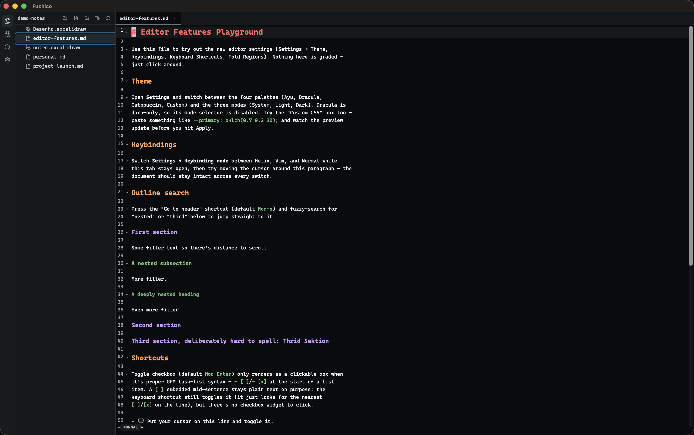
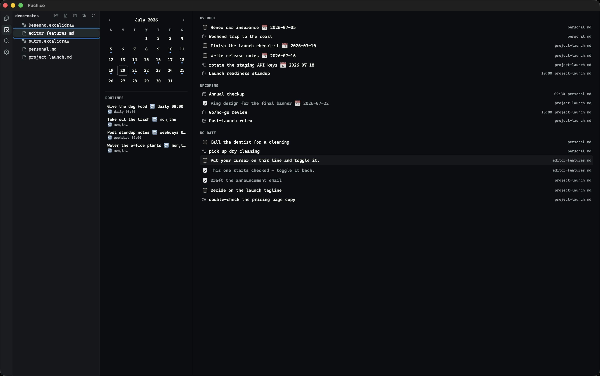
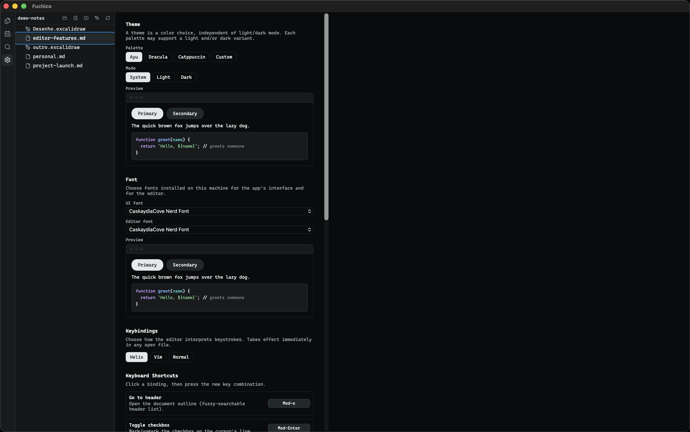
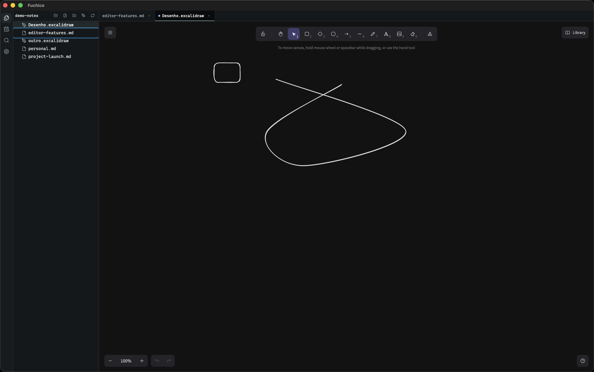

<div align="center">
  

  # Fuchico

  **A fast, standalone desktop notes editor with real Helix modal editing.**

  Tauri 2 · React 19 · CodeMirror 6

  [Português (BR)](#português-br) · [English](#english)
</div>

---

## English

### What is Fuchico?

Fuchico is a lightweight desktop notes and code editor built with **Tauri 2** and
**CodeMirror 6**. It plugs `codemirror-helix` into a plain CM6 host — no
competing keymaps, no half-working WYSIWYG decorations — so [Helix](https://helix-editor.com/)-style
modal editing behaves the way it's supposed to. On top of that it layers
Obsidian-like markdown live preview, a virtualized file explorer, a global
task/calendar view, and native CalDAV sync.

It's built for people who want their notes to live as plain markdown files on
disk, edited with modal keybindings, without needing a browser tab or a
plugin ecosystem.

### Screenshots

| Editor | Tasks & Calendar |
| --- | --- |
|  |  |

| Settings | Excalidraw canvas |
| --- | --- |
|  |  |

### Features

**Editing**
- True Helix modal editing (`codemirror-helix`) — normal/insert/select modes,
  multiple selections, and Helix's selection-first command grammar, without
  fighting a competing vim keymap.
- Markdown live-preview styling: rendered headings, checkboxes, callouts, and
  fold-gutter arrows directly in the editor, not a separate preview pane.
- Fenced code-block toolbar with a language picker and syntax highlighting
  for JS/TS, Python, Rust, HTML, CSS, JSON, and more.
- Region folding (`<!-- fold -->`-style regions) with a dedicated fold widget,
  plus a document outline overlay for quick navigation between headings.
- Fuzzy-match powered navigation and search-in-file.
- Mermaid diagram preview rendered inline inside markdown code fences.
- Embedded Excalidraw canvas for freeform sketches/diagrams saved alongside
  your notes (`.excalidraw` files).

**File management**
- Virtualized file explorer (handles large vaults smoothly) with create,
  rename, and delete for files and folders.
- Tabbed editing with per-tab document state.
- Full-text search across the whole notes folder.

**Tasks & Calendar**
- A global Agenda view that scans your notes for markdown checkboxes,
  `TODO:` lines, and `📅` date markers.
- Tasks are grouped into Overdue / Today / Upcoming / No-date, with in-place
  checkbox toggling that writes straight back to the source file.
- Click-to-jump takes you straight to the originating line in the editor.
- A CalDAV-style mini calendar view of the same data.

**CalDAV sync**
- Add CalDAV accounts (iCloud, Nextcloud, Fastmail, etc.) and discover their
  calendars.
- Link local note folders to remote calendars for two-way sync.
- Per-folder sync status and manual "sync now".

**Customization (Settings)**
- Theme selection.
- Full keybinding remapping.
- Custom keyboard shortcuts for app-level actions.
- Toggle the outline overlay and configure fold-region behavior.
- Font picker that reads the system's installed fonts (native Rust command,
  not a hardcoded web-font list).

### Tech stack

**Frontend**

| Package | Purpose |
| --- | --- |
| [React 19](https://react.dev/) + [TypeScript](https://www.typescriptlang.org/) | UI framework |
| [Vite 7](https://vitejs.dev/) | Dev server & bundler |
| [`@uiw/react-codemirror`](https://uiwjs.github.io/react-codemirror/) | React bindings for CodeMirror 6 |
| [`@codemirror/state`](https://github.com/codemirror/state), [`@codemirror/view`](https://github.com/codemirror/view), [`@codemirror/commands`](https://github.com/codemirror/commands) | CodeMirror 6 core |
| [`@codemirror/language`](https://github.com/codemirror/language), [`@codemirror/language-data`](https://github.com/codemirror/language-data) | Language/syntax framework |
| [`@codemirror/lang-markdown`](https://github.com/codemirror/lang-markdown), [`@codemirror/lang-javascript`](https://github.com/codemirror/lang-javascript), [`@codemirror/lang-python`](https://github.com/codemirror/lang-python), [`@codemirror/lang-rust`](https://github.com/codemirror/lang-rust), [`@codemirror/lang-html`](https://github.com/codemirror/lang-html), [`@codemirror/lang-css`](https://github.com/codemirror/lang-css), [`@codemirror/lang-json`](https://github.com/codemirror/lang-json) | Per-language support |
| [`@codemirror/lint`](https://github.com/codemirror/lint), [`@codemirror/search`](https://github.com/codemirror/search) | Linting & in-editor search |
| [`@lezer/highlight`](https://github.com/lezer-parser/highlight), [`@lezer/common`](https://github.com/lezer-parser/common) | Syntax tree & highlighting (Lezer parser) |
| [`codemirror-helix`](https://gitlab.com/_rvidal/codemirror-helix) | Helix modal keybindings for CM6 |
| [`@replit/codemirror-vim`](https://github.com/replit/codemirror-vim) | Vim keybindings for CM6 |
| [Mermaid](https://mermaid.js.org/) | Inline diagram rendering |
| [Excalidraw](https://excalidraw.com/) ([`@excalidraw/excalidraw`](https://github.com/excalidraw/excalidraw)) | Embedded sketch/diagram canvas |
| [TanStack Virtual](https://tanstack.com/virtual) | Virtualized file explorer |
| [Lucide](https://lucide.dev/) | Icon set |
| [Biome](https://biomejs.dev/) | Linting & formatting |

**Backend / shell**

| Crate | Purpose |
| --- | --- |
| [Tauri 2](https://tauri.app/) | Desktop app shell (Rust ↔ WebView bridge) |
| [`tauri-plugin-dialog`](https://v2.tauri.app/plugin/dialog/), [`tauri-plugin-opener`](https://v2.tauri.app/plugin/opener/), [`tauri-plugin-log`](https://v2.tauri.app/plugin/logging/) | Tauri plugins |
| [`reqwest`](https://github.com/seanmonstar/reqwest) | HTTP client (CalDAV requests) |
| [`quick-xml`](https://github.com/tafia/quick-xml) | CalDAV/WebDAV XML parsing |
| [`icalendar`](https://github.com/hoodie/icalendar-rs) | iCalendar (`.ics`) parsing/generation |
| [`keyring`](https://github.com/hwchen/keyring-rs) | Secure credential storage (Keychain) |
| [`font-kit`](https://github.com/servo/font-kit) | System font enumeration |
| [`tokio`](https://tokio.rs/) | Async runtime |
| [`serde`](https://serde.rs/) / [`serde_json`](https://github.com/serde-rs/json) | Serialization |
| [`chrono`](https://github.com/chronotope/chrono) | Date/time handling |
| [`regex`](https://github.com/rust-lang/regex) | Task/date scanning |
| [`uuid`](https://github.com/uuid-rs/uuid), [`sha2`](https://github.com/RustCrypto/hashes) | IDs & hashing |

### Development

Requirements: [pnpm](https://pnpm.io/), a Rust toolchain (for Tauri), and the
[Tauri prerequisites](https://tauri.app/start/prerequisites/) for your OS.

```bash
pnpm install
pnpm tauri dev
```

Other useful scripts:

```bash
pnpm check-types            # TypeScript type-checking
pnpm lint / pnpm lint:fix   # Biome lint
pnpm format                 # Biome format

# from src-tauri/
cargo test
cargo clippy --all-targets
```

There's a `demo-notes/` folder in the repo with example markdown/Excalidraw
files that exercise most editor features — open it as your vault to try
things out quickly.

---

## Português (BR)

### O que é o Fuchico?

O Fuchico é um editor de notas e código para desktop, leve e independente,
construído com **Tauri 2** e **CodeMirror 6**. Ele integra o
`codemirror-helix` diretamente em um host CM6 puro — sem keymaps
concorrentes, sem decorações WYSIWYG pela metade — para que a edição modal
no estilo [Helix](https://helix-editor.com/) funcione exatamente como
deveria. Por cima disso, ele adiciona uma pré-visualização de markdown ao
estilo Obsidian, um explorador de arquivos virtualizado, uma visão global de
tarefas/calendário e sincronização nativa via CalDAV.

Feito para quem quer manter suas notas como arquivos markdown simples no
disco, editados com atalhos modais, sem depender de uma aba de navegador ou
de um ecossistema de plugins.

### Capturas de tela

| Editor | Tarefas e Calendário |
| --- | --- |
|  |  |

| Configurações | Tela do Excalidraw |
| --- | --- |
|  |  |

### Funcionalidades

**Edição**
- Edição modal Helix de verdade (`codemirror-helix`) — modos
  normal/inserção/seleção, múltiplas seleções e a gramática de comandos
  "seleção primeiro" do Helix, sem brigar com um keymap de vim concorrente.
- Pré-visualização de markdown ao vivo: títulos renderizados, checkboxes,
  callouts e setas de fold-gutter diretamente no editor, sem precisar de um
  painel de preview separado.
- Barra de ferramentas em blocos de código com seletor de linguagem e
  realce de sintaxe para JS/TS, Python, Rust, HTML, CSS, JSON e outras.
- Dobra de regiões (regions no estilo `<!-- fold -->`) com widget de fold
  dedicado, além de um overlay de esboço (outline) do documento para
  navegação rápida entre títulos.
- Navegação e busca no arquivo com correspondência fuzzy.
- Pré-visualização de diagramas Mermaid renderizada diretamente dentro dos
  blocos de código do markdown.
- Tela do Excalidraw embutida para esboços/diagramas livres salvos junto das
  suas notas (arquivos `.excalidraw`).

**Gerenciamento de arquivos**
- Explorador de arquivos virtualizado (lida bem com vaults grandes) com
  criação, renomeação e exclusão de arquivos e pastas.
- Edição em abas, com estado de documento independente por aba.
- Busca em texto completo em toda a pasta de notas.

**Tarefas e Calendário**
- Uma visão global de Agenda que varre suas notas em busca de checkboxes de
  markdown, linhas `TODO:` e marcadores de data `📅`.
- As tarefas são agrupadas em Atrasadas / Hoje / Próximas / Sem data, com
  marcação de checkbox in-place que grava direto no arquivo de origem.
- Clique para pular direto para a linha de origem no editor.
- Uma mini visão de calendário, ao estilo CalDAV, com os mesmos dados.

**Sincronização CalDAV**
- Adicione contas CalDAV (iCloud, Nextcloud, Fastmail, etc.) e descubra os
  calendários disponíveis.
- Vincule pastas de notas locais a calendários remotos para sincronização
  bidirecional.
- Status de sincronização por pasta e opção de "sincronizar agora" manual.

**Personalização (Configurações)**
- Seleção de tema.
- Remapeamento completo de atalhos de teclado (keybindings).
- Atalhos de teclado customizados para ações do próprio app.
- Ativar/desativar o overlay de outline e configurar o comportamento de
  dobra de regiões (fold).
- Seletor de fontes que lê as fontes instaladas no sistema (comando nativo
  em Rust, não uma lista fixa de web-fonts).

### Stack técnica

**Frontend**

| Pacote | Finalidade |
| --- | --- |
| [React 19](https://react.dev/) + [TypeScript](https://www.typescriptlang.org/) | Framework de UI |
| [Vite 7](https://vitejs.dev/) | Servidor de dev & bundler |
| [`@uiw/react-codemirror`](https://uiwjs.github.io/react-codemirror/) | Bindings React para o CodeMirror 6 |
| [`@codemirror/state`](https://github.com/codemirror/state), [`@codemirror/view`](https://github.com/codemirror/view), [`@codemirror/commands`](https://github.com/codemirror/commands) | Núcleo do CodeMirror 6 |
| [`@codemirror/language`](https://github.com/codemirror/language), [`@codemirror/language-data`](https://github.com/codemirror/language-data) | Framework de linguagem/sintaxe |
| [`@codemirror/lang-markdown`](https://github.com/codemirror/lang-markdown), [`@codemirror/lang-javascript`](https://github.com/codemirror/lang-javascript), [`@codemirror/lang-python`](https://github.com/codemirror/lang-python), [`@codemirror/lang-rust`](https://github.com/codemirror/lang-rust), [`@codemirror/lang-html`](https://github.com/codemirror/lang-html), [`@codemirror/lang-css`](https://github.com/codemirror/lang-css), [`@codemirror/lang-json`](https://github.com/codemirror/lang-json) | Suporte por linguagem |
| [`@codemirror/lint`](https://github.com/codemirror/lint), [`@codemirror/search`](https://github.com/codemirror/search) | Linting & busca no editor |
| [`@lezer/highlight`](https://github.com/lezer-parser/highlight), [`@lezer/common`](https://github.com/lezer-parser/common) | Árvore de sintaxe & highlighting (parser Lezer) |
| [`codemirror-helix`](https://gitlab.com/_rvidal/codemirror-helix) | Atalhos modais do Helix para o CM6 |
| [`@replit/codemirror-vim`](https://github.com/replit/codemirror-vim) | Atalhos do Vim para o CM6 |
| [Mermaid](https://mermaid.js.org/) | Renderização de diagramas inline |
| [Excalidraw](https://excalidraw.com/) ([`@excalidraw/excalidraw`](https://github.com/excalidraw/excalidraw)) | Tela embutida de esboços/diagramas |
| [TanStack Virtual](https://tanstack.com/virtual) | Explorador de arquivos virtualizado |
| [Lucide](https://lucide.dev/) | Conjunto de ícones |
| [Biome](https://biomejs.dev/) | Lint & formatação |

**Backend / shell**

| Crate | Finalidade |
| --- | --- |
| [Tauri 2](https://tauri.app/) | Shell do app desktop (ponte Rust ↔ WebView) |
| [`tauri-plugin-dialog`](https://v2.tauri.app/plugin/dialog/), [`tauri-plugin-opener`](https://v2.tauri.app/plugin/opener/), [`tauri-plugin-log`](https://v2.tauri.app/plugin/logging/) | Plugins do Tauri |
| [`reqwest`](https://github.com/seanmonstar/reqwest) | Cliente HTTP (requisições CalDAV) |
| [`quick-xml`](https://github.com/tafia/quick-xml) | Parsing de XML CalDAV/WebDAV |
| [`icalendar`](https://github.com/hoodie/icalendar-rs) | Parsing/geração de iCalendar (`.ics`) |
| [`keyring`](https://github.com/hwchen/keyring-rs) | Armazenamento seguro de credenciais (Keychain) |
| [`font-kit`](https://github.com/servo/font-kit) | Enumeração de fontes do sistema |
| [`tokio`](https://tokio.rs/) | Runtime assíncrono |
| [`serde`](https://serde.rs/) / [`serde_json`](https://github.com/serde-rs/json) | Serialização |
| [`chrono`](https://github.com/chronotope/chrono) | Manipulação de datas/horas |
| [`regex`](https://github.com/rust-lang/regex) | Varredura de tarefas/datas |
| [`uuid`](https://github.com/uuid-rs/uuid), [`sha2`](https://github.com/RustCrypto/hashes) | IDs & hashing |

### Desenvolvimento

Pré-requisitos: [pnpm](https://pnpm.io/), um toolchain Rust (para o Tauri) e
os [pré-requisitos do Tauri](https://tauri.app/start/prerequisites/) para o
seu sistema operacional.

```bash
pnpm install
pnpm tauri dev
```

Outros scripts úteis:

```bash
pnpm check-types            # checagem de tipos TypeScript
pnpm lint / pnpm lint:fix   # lint com Biome
pnpm format                 # formatação com Biome

# a partir de src-tauri/
cargo test
cargo clippy --all-targets
```

Há uma pasta `demo-notes/` no repositório com arquivos markdown/Excalidraw de
exemplo que exercitam a maioria das funcionalidades do editor — abra-a como
seu vault para experimentar rapidamente.
